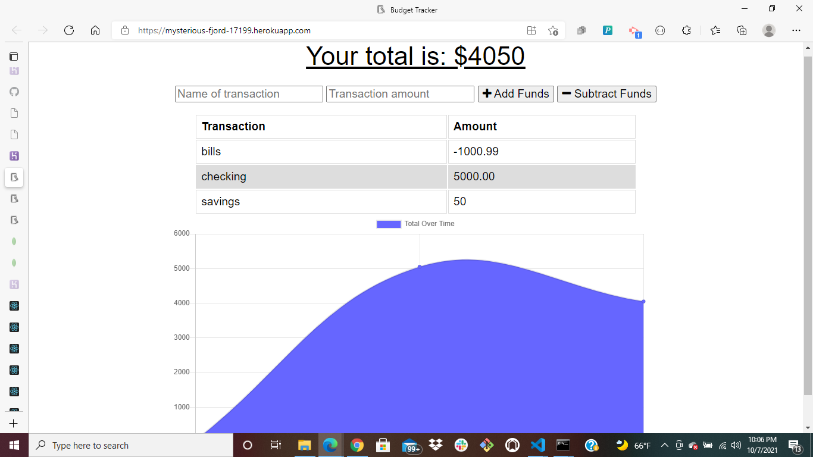

# Budget Tracker
## Table of Contents

>[Description](#Description)

>[Installation](#Installation)

>[Usage](#Usage)

>[Screenshots](#Screenshots)

>[Deploy](#Deploy)

## Description

> The budget tracker is a progressive web application to track your budget. 

> This software can be used in offline mode and will upload offline data to the database when reconnected.

## Installation

* This application installs:
* javascript
* node
* node modules
* compression
* MongoDB
* Mongoose
* Express
* Morgan
* lite-server

## Usage 

This Budget Tracker app can be used to keep track of the amount of money added, or the amount withdrawn in the transaction. You can either add or subtract a new transaction.
## Screenshots

## Deploy

>[Heroku](https://mysterious-fjord-17199.herokuapp.com/)

>[Github](https://github.com/Maalie04/budget-tracker/)

